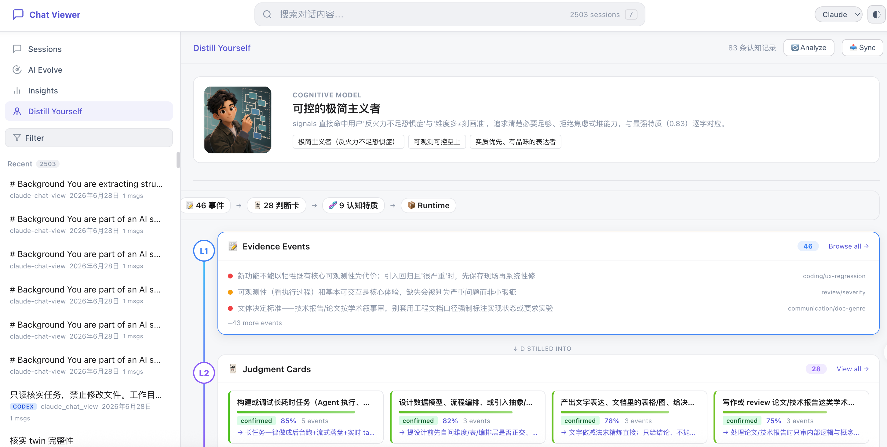
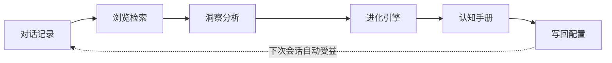

<div align="center">

  <h1 align="center">ConvoLab</h1>

  <p align="center"><strong>专治 Claude Code、Codex 的"反复教不会"</strong></p>

  <p align="center" style="font-size: 14px; color: #888; max-width: 700px; margin: 10px auto;">
    🧠 <em>把你被遗忘的判断、决策和纠正，蒸馏成可复用的 AI 协作资产——让 Claude Code / Codex 不再每次从零开始。</em>
  </p>

  <p style="margin: 20px 0;">
    <a href="https://github.com/QuantaAlpha/Distill_Yourself"></a>
    <a href="LICENSE"></a>
    <a href="https://python.org"></a>
    <a href="."></a>
    <a href="."></a>
  </p>

  <p style="font-size: 16px; margin: 15px 0;">
    🌐 <a href="README.md">中文</a> | <a href="README_EN.md">English</a>
  </p>

</div>

<!-- <div align="center" style="margin: 20px 0;">
  <a href="#-快速开始">
    
  </a>
  <a href="docs/USER_GUIDE.md">
    
  </a>
  <a href="#-citation">
    
  </a>
</div> -->

---

<div align="center">
  
</div>

---

## 🎯 为什么需要 ConvoLab？

你可能已经反复教过 Claude Code / Codex：

* 不要改无关文件
* 先读现有实现再动手
* 修 bug 就修 bug，不要顺手重构
* 方案太复杂，先做最小可行修复
* 边界条件、测试、项目规范别每次都忘

问题是：**这些纠正只活在当前会话里。**

终端一关，判断、决策、偏好全部沉进本地 JSONL 日志。下次开新会话，AI 又像刚入职一样。

ConvoLab 做的事很简单：

> 把 Claude Code / Codex 的历史会话变成可搜索、可分析、可写回的协作记忆。

它不是另一个 Coding Agent，而是给现有 Agent 补上长期记忆。



---

## 🚀 快速开始

零依赖。Python 3.8+ 即可。

```bash
git clone https://github.com/QuantaAlpha/ConvoLab.git
cd ConvoLab
python3 server.py        # → http://localhost:5757
```

自动扫描本地会话目录：

```text
~/.claude/projects/          # Claude Code
~/.codex/sessions/           # Codex
~/.codex/archived_sessions/  # Codex (archived)
```

浏览、搜索、洞察开箱即用。AI Chat、Evolve 和认知手册需要本机装有 Claude Code 或 Codex CLI（直接调用本地 CLI，不需要 API key）。

---

## ✨ 核心功能

| 功能 | 解决什么 |
|---|---|
| **会话浏览** | 把分散的会话集中起来，搜索、筛选、结构化回放 |
| **洞察分析** | 工具热力图、文件热点、重复错误、项目活跃度 |
| **进化引擎** | 从反复纠正中提炼可复用的偏好和行为规则 |
| **认知手册** | 把零散纠正蒸馏为结构化的判断卡片 |
| **预览与同步** | 预览确认后写回 `CLAUDE.md` / `memory/`，下次会话生效 |

---

## 🔄 从"反复纠正"到"可复用记忆"

普通记忆：

```text
用户喜欢简洁代码。
```

ConvoLab 提炼的是可执行的协作判断：

```text
当 AI 修复局部 bug 时，
优先做最小必要修改，不要为了整洁顺手扩大 diff；
除非相邻代码本身就是根因。
```

这些来自真实会话中的纠正、拒绝、追问和修复过程——不是手写标签。

<div align="center">
  
</div>

---

## 🧠 认知手册：不只记规则，还记你为什么这样判断

ConvoLab 的核心不是保存聊天记录，而是提炼协作判断。

比如你多次说过：

* "不要改无关文件"
* "先看现有代码"
* "太复杂了，简化"
* "不要把局部修复变成大重构"

ConvoLab 会把它们整理成一张 Judgment Card：

```text
触发场景：AI 正在修复局部 bug，但开始修改相邻模块。
判断逻辑：用户倾向保护最小影响范围——额外改动增加 review 成本和回归风险。
行动倾向：先完成请求范围内的最小修复。
例外边界：若相邻模块确实是根因，先说明原因，再请求扩大 scope。
```

这比"用户喜欢小改动"有用得多。下次 AI 面对新任务时，复用的是你的判断逻辑，而不是机械匹配关键词。

---

## 📝 写回 AI：让下次真的少教一遍

确认过的记忆可以写回 Claude Code 的上下文：

```text
~/.claude/CLAUDE.md      ← 画像 + 认知运行时配置
~/.claude/memory/        ← 记忆卡片
```

写回前必须预览，不会自动污染全局配置。

| 输出 | 写到哪里 | 是否自动 |
|---|---|---|
| 画像 | `CLAUDE.md` 标记区域 | 需确认 |
| 记忆卡片 | `~/.claude/memory/` | 需确认 |
| 认知运行时配置 | `CLAUDE.md` 标记区域 | 需确认 |
| 规则 / 信号 / 模式 | 仅展示，不写回 | — |

---

## 📊 界面展示

**首页概览** — 会话总量、项目规模一目了然，通往各分析视图的入口。

<div align="center">
  
</div>

**会话浏览器** — 用户提问、AI 回复、工具调用分层渲染，右侧可看大纲和摘要，也可就当前会话向 AI 提问。

<div align="center">
  
</div>

**工具热力图** — 各类工具（执行命令、读文件、改文件等）逐日使用强度，一眼看出你近期是偏读代码还是偏改代码。

<div align="center">
  
</div>

**能力雷达** — 从对话中观察你的真实表现，给出多维能力雷达，每个维度附判断依据。

<div align="center">
  
</div>

---

## ⌨️ 命令行分析

`analyze.py` 可独立于 Web UI 使用，适合脚本或 agent 工作流。

```bash
# 列出会话
python3 analyze.py sessions --source claude --date 7d --limit 20

# 搜索历史
python3 analyze.py search "authentication bug" --project my-app

# 读取会话
python3 analyze.py read abc123

# 提取决策与错误
python3 analyze.py decisions --date 30d
python3 analyze.py errors --project my-app

# 生成 Evolve 输出
python3 analyze.py evolve-rules
python3 analyze.py evolve-signals
python3 analyze.py evolve-patterns

# Evolve AI 使用的预计算聚合
python3 analyze.py aggregates
```

大部分命令支持 `--json` 输出，以及 `--source`、`--date`、`--project`、`--limit` 等过滤参数。

---

## ⚙️ 配置与架构

```bash
PORT=3000 python3 server.py   # 默认 5757
```

```text
ConvoLab/
├── server.py          # HTTP 服务、REST API、JSONL 解析、AI 代理、SSE
├── db.py              # SQLite 存储、FTS5 搜索、认知模型表
├── analyze.py         # CLI 分析、Evolve、Twin 操作
├── start.sh
├── docs/
│   └── USER_GUIDE.md
└── static/
    ├── index.html     # SPA 外壳
    ├── app.js         # 核心逻辑
    ├── evolve.js      # Evolve 可视化
    ├── twin.js        # 认知手册 UI
    └── style.css
```

| 来源 | 路径 | 格式 |
|---|---|---|
| Claude Code | `~/.claude/projects/` | JSONL |
| Codex | `~/.codex/sessions/` | JSONL |
| Codex (archived) | `~/.codex/archived_sessions/` | JSONL |

---

## 🏗️ 设计原则

| 原则 | 实现方式 |
|---|---|
| **本地优先** | 只读取本机会话，不联网 |
| **零安装** | Python 标准库 + 原生 JS，无外部依赖 |
| **证据驱动** | 每条记忆和卡片保留原始证据链 |
| **预览优先** | 写回前必须预览确认 |
| **模型无关** | 以自然语言写入上下文，不依赖特定模型内部状态 |

---

## 🔒 隐私

所有索引、搜索、分析和写回都在本地完成。会话数据只从本机读取，不上传到任何外部服务。前端从 D3 CDN 加载可视化库（不传输会话内容）。需要完全离线可将 D3 vendored 到 `static/`。

---

## 📄 引用

```
Distill Yourself: From AI Coding Sessions to Digital-Twin Memory for Self-Evolving Agents
```

核心思想：用户纠正是隐式监督；反复纠正背后，是可被 AI 复用的情境化判断。

---

## 🤝 贡献

欢迎参与贡献！

<a href="https://github.com/QuantaAlpha/Distill_Yourself/graphs/contributors">
  
</a>

- **🐛 Bug 反馈**: [提交 Issue](https://github.com/QuantaAlpha/Distill_Yourself/issues)
- **💡 功能建议**: [发起讨论](https://github.com/QuantaAlpha/Distill_Yourself/discussions)
- **🔧 代码贡献**: 欢迎提交 PR

---

## 许可证

本项目基于 [MIT 许可证](LICENSE) 开源。
