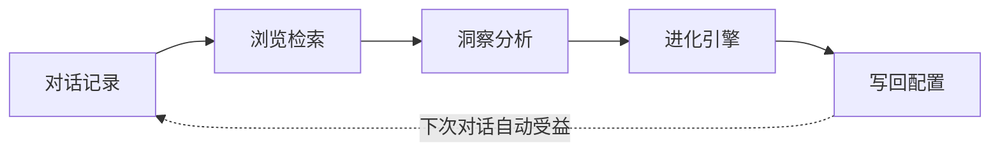
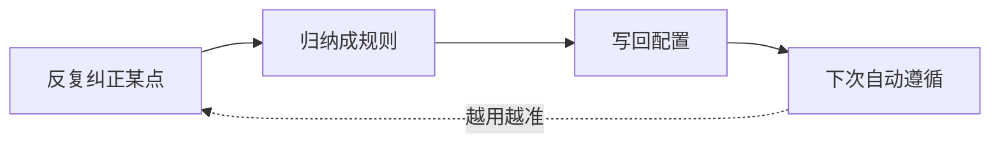

<div align="center">

# ConvoLab

**让与 AI 的对话沉淀为可复用的资产，而不是用完即弃。**

ConvoLab 是一个本地运行的 AI 会话分析工具。它会读取你与 Claude Code、Codex 等编程助手产生的全部对话，索引成一个可检索、可分析的知识库；在此之上，它能归纳出你的开发习惯、偏好与反复纠正过的要点，并把这些结论回写进 AI 的配置文件，让之后的协作越来越贴合你的方式。

它适合每天大量使用 AI 编程助手、又希望把这些对话真正利用起来的开发者。

[](https://python.org)
[](.)
[](.)
[](https://sqlite.org)
[](https://d3js.org)

</div>

---

## Quick Start

ConvoLab 零依赖：不需要 pip、npm 或 Docker，本机有 Python 3.8 及以上版本即可运行。

```bash
git clone https://github.com/QuantaAlpha/ConvoLab.git
cd ConvoLab
python3 server.py
```

启动后打开 `http://localhost:5757` 就能使用。它会自动扫描 Claude Code 与 Codex 的会话目录，无需手动导入，两类来源会汇总在同一个列表里并标注区分。

浏览、搜索、洞察这些功能不依赖任何 AI 引擎，开箱即用；AI Chat 与进化引擎则需要本机装有 Claude Code 或 Codex 的命令行工具。ConvoLab 直接调用本地 CLI，不需要任何 API key。

```bash
npm i -g @openai/codex
# or
npm i -g @anthropic-ai/claude-code
```

Prerequisites:

- Python 3.8+
- Claude Code session data: `~/.claude/projects/`
- Codex session data: `~/.codex/sessions/`

---

## 它解决什么问题

你和 AI 的每一次对话里，都沉淀着有价值的东西：某个架构当时为什么这么定、一个 bug 的排查过程、你一再强调的代码风格和规范。但终端一关，这些就散进了几乎没人会再打开的日志文件。

这些记录还在不断流失：会话没有趁手的检索手段，旧记录分散在不同工具和目录中，上下文一压缩，你交代过的规范也会被丢掉。结果是每开一个新会话，AI 都从零开始，你只能把同样的要求反复再讲一遍。

ConvoLab 要做的，是把这些对话变成能持续复用的资产。它分三层推进：先把对话**汇集**起来看得见，再从中**洞察**出规律，最后让 AI 据此**进化**，并形成闭环。




---

## 一、浏览：找回你的任何一段对话

第一层解决最基础的需求：把分散在各处的对话汇到一处，让你随时能翻回去。

- **双源汇集**：同时收录 Claude Code 与 Codex 的会话，按项目和时间组织，一处看全。
- **全文检索**：在会话标题和你的提问里搜索，命中后直接跳到那一条消息，不必逐个翻。
- **多维筛选**：按来源、时间范围、项目层层收窄，几千个会话也能很快定位。
- **结构化阅读**：用户提问、AI 回复、工具调用、思考过程会被分层渲染，冗长的工具调用默认折叠，让你专注在对话主线上；右侧还能看会话大纲、自动摘要，并就当前这个会话直接向 AI 提问。


---

## 二、洞察：看清你的使用模式

把对话汇起来之后，下一层是从几百个会话里提炼出规律。**洞察（Insights）** 把这些规律算成五张一目了然的视图，全部在本地完成，不需要 AI 引擎。

| 视图 | 它告诉你什么 |
|---|---|
| 工具热力图 | 各类工具（执行命令、读文件、改文件等）逐日的使用强度，看出你近期是偏读代码还是偏改代码 |
| 文件热点 | 哪些文件被反复读写，定位你的主战场 |
| 错误模式 | 反复出现的报错被聚成同类，附出现次数和涉及的项目，看清总在哪类问题上栽跟头 |
| 项目健康 | 每个项目的会话量、活跃度，以及上升 / 下降趋势 |
| 代码片段 | 对话里产生的代码被集中起来，并标注它最终是否真的写进了文件 |

这些不是原始数据的堆砌，而是把几百个会话的行为压缩成可读的指纹。隔段时间回看一次，很容易发现自己和 AI 反复踩的坑，以及精力到底花在了哪里。


---

## 三、进化：让 AI 越来越懂你

这是 ConvoLab 的核心。前两层都是“看”，**进化引擎（Evolve）** 则真正从你的历史里归纳出关于“你”的结论，并能回写给 AI。可以把它理解成一份体检报告，五个维度各回答一个问题。

| 维度 | 回答的问题 | 呈现形式 |
|---|---|---|
| Profile 画像 | 你是个什么样的开发者 | 职业画像卡 + 能力雷达 |
| Memory 记忆 | 下一个 AI 怎么做才合你意 | 偏好关系图 + 记忆卡片 |
| Rules 规则 | 你纠正过 AI 什么 | 按优先级排列、附原话的规则 |
| Signals 信号 | 纠正在变多还是变少 | 分类堆叠的时间线 |
| Patterns 模式 | 什么问题反复出现 | 频率气泡 + 改进建议 |

每个维度都由本机 AI 分析生成，点一下刷新就开始，整个分析过程实时可见。下面挑两个最直观的看。

**Profile（画像）** 不靠你自己填写，而是从对话中观察你的真实表现，给出一份职业画像，以及一张多维能力雷达。雷达的维度由分析自动归纳，每个人不尽相同。这往往是第一次从外部视角看见 AI 眼里的自己。


**Memory（记忆）** 把你那些可以照着执行的偏好，整理成“遇到 X 就做 Y、避免 Z”的记忆卡片，并连成一张关系图。每张卡片都能追溯到支撑它的对话原文，不是凭空总结。


其余三个维度互为补充：**Rules** 把你的高频纠正按 P0/P1/P2 分级并附上原话，**Signals** 在时间轴上呈现各类纠正的增减趋势，**Patterns** 用气泡聚类反复出现的问题并给出改进建议，一起构成对你使用习惯的完整刻画。

---

## 四、闭环：把发现写回 AI

这是 ConvoLab 区别于一般“只读”工具的根本所在：分析出的结论不止于展示，还能回写到 AI 的配置，下次启动即生效。



- **只回写画像与记忆两类**：Profile 写入 AI 的全局配置文件，Memory 写入它的记忆目录；Rules、Signals、Patterns 仅供查看参考，不会自动回写。
- **写入前两步确认**：先预览将创建、更新或跳过哪些内容、配置文件是替换还是追加，确认无误后才落盘。改的是全局配置，建议每次先看一眼预览。

---

## 其它能力

- **AI Chat**：用自然语言直接问你的历史。会话级只分析当前这一个会话，例如“这个 bug 的根因是什么”；全局级则跨全部会话，例如“最近哪个项目报错最多”。两边都内置一组预设提问，包括需求梳理、决策提取、规则生成、效率分析等，点一下即可发起。由本机 AI 驱动，回答流式返回。
- **命令行 `analyze.py`**：网页背后的分析工具，也能单独在终端使用，支持按来源、时间、项目筛选并输出 JSON，方便接入你自己的脚本。

---

## Configuration

| Variable | Default | Description |
|---|---:|---|
| `PORT` | `5757` | Local server port |

```bash
PORT=3000 python3 server.py
```

---

## Architecture

```text
ConvoLab/
├── server.py            # HTTP server, REST API, JSONL parser, AI proxy, SSE streaming
├── db.py                # SQLite storage, messages, FTS5 search, pre-aggregates
├── analyze.py           # Standalone CLI analytics and Evolve generators
├── start.sh             # Quick launcher
├── docs/
│   └── USER_GUIDE.md    # Extended Chinese user guide
└── static/
    ├── index.html       # SPA shell
    ├── app.js           # Core application logic
    ├── evolve.js        # D3.js interactive visualizations
    └── style.css        # UI theme
```

| Principle | Implementation |
|---|---|
| Zero install | Python stdlib server and vanilla JS frontend; D3.js is loaded by the browser |
| Privacy first | Session data is read from local `~/.claude/` and `~/.codex/`; no telemetry |
| Incremental parsing | File mtimes are tracked, only changed JSONL files are re-parsed |
| SQLite + FTS5 | Sessions and messages are stored in `.cache/sessions.db` with full-text search |
| SSE streaming | AI Chat and Evolve progress stream in real time |

Data sources:

| Source | Location | Format |
|---|---|---|
| Claude Code | `~/.claude/projects/` | JSONL |
| Codex | `~/.codex/sessions/` and `~/.codex/archived_sessions/` | JSONL |

---

## REST API

<details>
<summary><b>Endpoints</b></summary>

| Method | Endpoint | Description |
|---|---|---|
| `GET` | `/api/sessions` | List sessions |
| `GET` | `/api/session/:id` | Full message history for a session |
| `GET` | `/api/session-summary` | Condensed session summary |
| `GET` | `/api/projects` | List detected projects |
| `GET` | `/api/search?q=...` | Search session titles and messages |
| `GET` | `/api/timeline` | Daily session counts |
| `GET` | `/api/analytics` | Tool usage and file hotspots |
| `GET` | `/api/project-health` | Per-project scores and trends |
| `GET` | `/api/snippets` | Extracted code snippets |
| `GET` | `/api/file-evolution` | Cross-session edit timeline for a file |
| `GET` | `/api/evolve/:tab` | Evolve data for profile, memory, rules, signals, or patterns |
| `GET` | `/api/stats` | Global statistics |
| `GET` | `/api/refresh` | Rebuild the session index |
| `POST` | `/api/chat` | AI chat |
| `POST` | `/api/chat/stream` | Streaming AI chat |
| `POST` | `/api/evolve/sync` | Sync Evolve results to Claude Code |

</details>

---

## CLI Analytics

`analyze.py` can be used independently of the web UI and is suitable for scripts or agent workflows.

```bash
# List sessions
python3 analyze.py sessions --source claude --date 7d --limit 20

# Search history
python3 analyze.py search "authentication bug" --project my-app

# Read a session
python3 analyze.py read abc123

# Extract decisions and errors
python3 analyze.py decisions --date 30d
python3 analyze.py errors --project my-app

# Generate Evolve outputs
python3 analyze.py evolve-rules
python3 analyze.py evolve-signals
python3 analyze.py evolve-patterns

# Pre-computed aggregates used by Evolve AI
python3 analyze.py aggregates
```

Most commands support `--json` and filters such as `--source`, `--date`, `--project`, and `--limit`.

---

## Privacy

ConvoLab 的会话索引、搜索、分析和配置回写都在本地完成。你的 Claude Code 与 Codex 对话数据只从本机目录读取，索引保存在本地 SQLite 中，不会被上传到 ConvoLab 的外部服务。

当前前端会从 D3 官方 CDN 加载可视化库；这不会上传你的会话内容。如果你需要完全离线运行，可以后续把 D3 文件 vendored 到 `static/` 并改为本地引用。

---

## Community

加入社区，交流 Distill Yourself 的使用经验、反馈和共创想法。

### WeChat


### Discord

[Join the Discord community](https://discord.gg/KDyuer49t)
