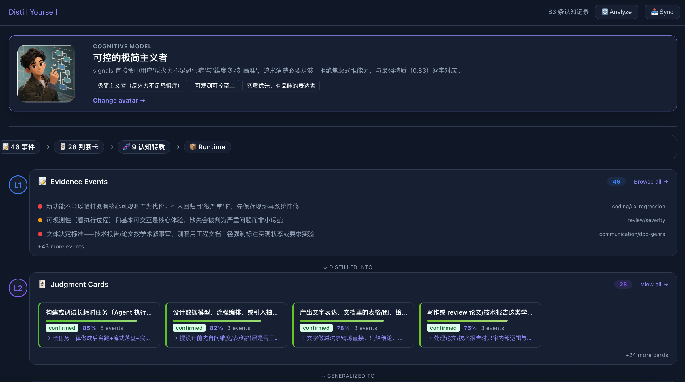
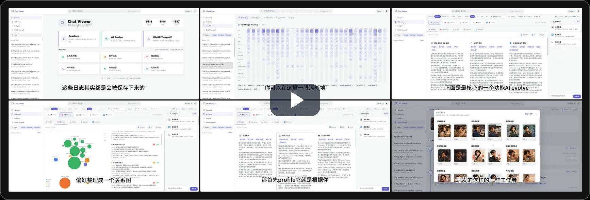
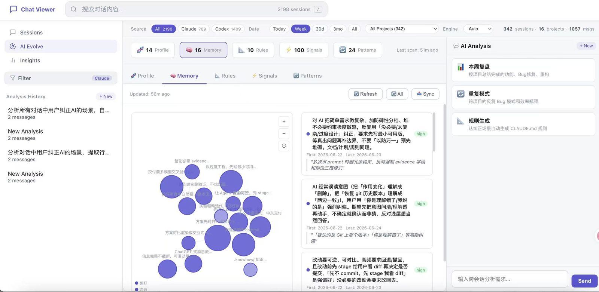
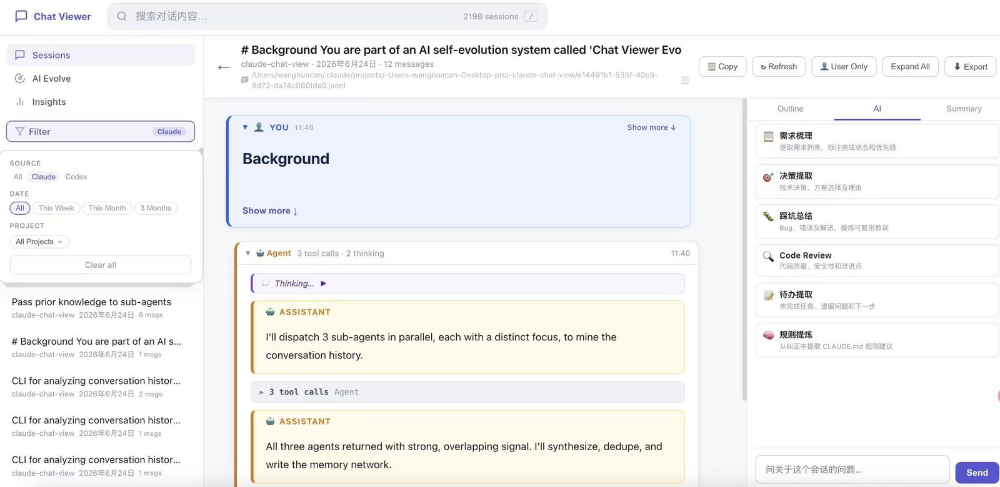
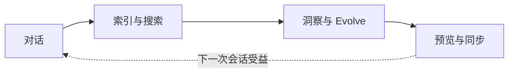

<div align="center">

**中文** | [English](README_EN.md)

# Distill Yourself

**检索你的 Claude Code 和 Codex 历史。蒸馏持久经验。教会未来的会话。**

你与 Claude Code、Codex 的每次对话里都藏着决策、调试心得和反复强调的偏好——但终端一关就全没了。Distill Yourself 在本地索引这些历史，让它们可搜索、可分析，并把筛选后的洞察回写进 AI 配置文件，让你不用再重复教。



[快速开始](#快速开始) · [功能特性](#功能特性) · [使用指南](docs/USER_GUIDE.md) · [API 参考](#rest-api)

[](https://python.org)
[](.)
[](.)
[](https://sqlite.org)
[](LICENSE)

</div>

---

## 快速开始

<div align="center">

<a href="https://quantaalpha.com/Distill_Yourself/video/?v=full-demo">
  
</a>

[点击封面观看完整演示视频（7:33）](https://quantaalpha.com/Distill_Yourself/video/?v=full-demo)

</div>

**方式 A — 全局安装，任意目录启动：**

```bash
# 使用 uv 安装（推荐）
uv pip install git+https://github.com/QuantaAlpha/Distill_Yourself.git

# 或使用 pip
pip install git+https://github.com/QuantaAlpha/Distill_Yourself.git

# 任意目录启动
distill-yourself
# 打开 http://localhost:5757
```

**方式 B — 克隆后直接运行（零安装）：**

```bash
git clone https://github.com/QuantaAlpha/Distill_Yourself.git
cd Distill_Yourself

# 零依赖 — 纯 Python 标准库
python3 server.py
# 打开 http://localhost:5757
```

Claude Code 和 Codex 的会话会自动检测，无需手动导入。

| 数据源 | 路径 | 状态 |
|--------|------|------|
| Claude Code | `~/.claude/projects/` | 自动检测 |
| Codex | `~/.codex/sessions/` 和 `~/.codex/archived_sessions/` | 自动检测 |

> **浏览、搜索和分析即开即用。** AI Chat 和 Evolve 功能调用你本地安装的 CLI 工具——不需要应用级 API Key，但至少需要安装并登录其中一个：
> `npm i -g @anthropic-ai/claude-code` 或 `npm i -g @openai/codex`

### 回写了什么？

Evolve 引擎可以把洞察同步到 AI 配置文件。**所有写入都需要预览和明确确认，不会静默写入。**

| 内容 | 目标 | 操作 |
|------|------|------|
| Profile（开发者画像） | `~/.claude/CLAUDE.md` | 追加或替换对应章节 |
| Memory（偏好记忆） | `~/.claude/memory/*.md` | 创建/更新单个记忆文件 |
| Rules、Signals、Patterns | — | 仅展示，不回写 |

> **Codex 会话已支持索引和搜索，但回写目前仅针对 Claude Code 配置。**

### 隐私与数据流向

- **索引、搜索和分析完全本地运行** — 对话数据从本地目录读取，索引存储在本地 SQLite 数据库（`.cache/sessions.db`）
- **AI Chat 和 Evolve** 调用你本机安装的 Claude Code 或 Codex CLI，CLI 可能会将选定上下文发送给各自的云服务商（Anthropic / OpenAI）— Distill Yourself 本身不直接调用任何 API
- **D3.js CDN** — 前端从 D3 官方 CDN 加载可视化库，不会传输你的对话数据。如需完全离线运行，可将 D3 文件放入 `static/`
- **配置回写** — 必须经过预览和明确确认（见上表）

---

## 功能特性

### 认知模型 — Distill Yourself

项目的核心功能。分析你的全部对话历史，通过三层抽象构建你的认知模型：

- **L1 — 证据事件**：从对话中提取的原始行为信号（纠正、偏好、反复出现的模式）
- **L2 — 判断卡片**：蒸馏出的决策倾向，带置信度评分和支撑证据
- **L3 — 认知特质**：泛化的性格和工作风格特征，每条都基于多张判断卡片

模型包含一个生成的认知头像和一句话人设摘要。所有结论都可追溯——点击任意特质即可查看背后的判断卡片和原始证据。用它来理解未来的 AI 会话应该记住你怎么思考和决策。


Runtime Pack 会把这些特质编译成一份简洁可读的开发者画像——随时可以同步到 AI 配置中。


[▶ 观看认知模型演示片段（1:55）](https://quantaalpha.com/Distill_Yourself/video/?v=cognitive-model)

### Evolve 引擎

分析反复出现的偏好、纠正和工作模式，生成配置更新供你预览后同步。

| 维度 | 回答什么问题 |
|------|-------------|
| **Profile** | 你是什么类型的开发者（人设卡 + 雷达图） |
| **Memory** | AI 应该记住什么（偏好图谱 + 证据卡片） |
| **Rules** | 你反复纠正过什么（P0/P1/P2 + 原文引用） |
| **Signals** | 纠正趋势是增还是减 |
| **Patterns** | 哪些问题反复出现（气泡聚类 + 建议） |




[▶ 观看 Evolve 演示片段（1:55）](https://quantaalpha.com/Distill_Yourself/video/?v=evolve)

### 浏览与搜索

- **双数据源聚合** — Claude Code + Codex 会话合并展示，按来源标记
- **全文搜索** — 跨会话标题和消息内容搜索，直接跳转匹配位置
- **多维筛选** — 按来源、时间范围或项目过滤
- **结构化阅读** — 展开消息、查看工具调用、通过大纲跳转；侧边栏显示 AI 摘要和会话级对话



[▶ 观看浏览与搜索演示片段（0:55）](https://quantaalpha.com/Distill_Yourself/video/?v=browse-search)

### 洞察

五个本地计算的分析视图——不需要 AI 引擎：

- **工具热力图** — 各工具类型的每日使用强度
- **文件热点** — 跨会话最常读写的文件
- **错误模式** — 按类型聚类的高频错误，含项目上下文
- **项目健康** — 各项目的会话量和活跃趋势
- **代码片段** — 生成的代码片段 + 是否已提交


[▶ 观看洞察演示片段（0:50）](https://quantaalpha.com/Distill_Yourself/video/?v=insights)

### AI Chat

用自然语言提问自己的历史——可以按单会话（"这个 bug 是什么原因？"）或跨会话（"这个月哪个项目错误最多？"）。内置需求提取、决策回顾、规则生成、效率分析等预设 prompt。流式响应由你本地安装的 CLI 驱动。

### 闭环



---

## 架构

```
Distill_Yourself/
├── chatview/       # Python 包：server、parsers、handlers、db、commands
├── server.py       # 入口（thin wrapper → chatview.server）
├── analyze.py      # CLI 入口（thin wrapper → chatview.cli）
├── db.py           # DB 入口（thin wrapper → chatview.db）
├── static/
│   ├── js/         # ES Modules 前端
│   ├── css/        # 组件化 CSS
│   ├── evolve.js   # Evolve 视图
│   └── twin.js     # Twin 视图
└── docs/
    └── USER_GUIDE.md
```

| 原则 | 实现方式 |
|------|---------|
| 零安装依赖 | Python 标准库服务器；D3.js 由浏览器从 CDN 加载 |
| 隐私优先 | 索引/搜索读取本地 `~/.claude/` 和 `~/.codex/`；AI 功能使用你安装的 CLI |
| 增量更新 | 追踪文件 mtime，仅重新解析变更的 JSONL 文件 |
| 快速搜索 | SQLite FTS5 全文索引，存储在 `.cache/sessions.db` |
| 实时响应 | AI Chat 和 Evolve 进度使用 SSE 流式传输 |

---

## CLI

`analyze.py` 可独立运行——适合脚本、管道或 Agent 工作流。

```bash
# 列出最近 7 天的 Claude 会话
python3 analyze.py sessions --source claude --date 7d --limit 20

# 跨所有对话全文搜索
python3 analyze.py search "authentication bug" --project my-app

# 读取某个会话的完整消息历史
python3 analyze.py read <session-id>

# 提取最近一个月的架构决策
python3 analyze.py decisions --date 30d

# 查找某项目的高频错误
python3 analyze.py errors --project my-app

# 生成 Evolve 输出（rules / signals / patterns）
python3 analyze.py evolve-rules

# 导出 Evolve AI 引擎使用的预计算分析
python3 analyze.py aggregates
```

大部分命令支持 `--json`、`--source`、`--date`、`--project` 和 `--limit`。

---

## REST API

<details>
<summary><b>Endpoints</b></summary>

| Method | Endpoint | Description |
|--------|----------|-------------|
| `GET` | `/api/sessions` | List sessions (filterable) |
| `GET` | `/api/session/:id` | Full message history |
| `GET` | `/api/session-summary` | Condensed summary |
| `GET` | `/api/projects` | Detected projects |
| `GET` | `/api/search?q=...` | Full-text search |
| `GET` | `/api/timeline` | Daily session counts |
| `GET` | `/api/analytics` | Tool usage & file hotspots |
| `GET` | `/api/project-health` | Per-project scores & trends |
| `GET` | `/api/snippets` | Extracted code snippets |
| `GET` | `/api/file-evolution` | Cross-session file edit timeline |
| `GET` | `/api/evolve/:tab` | Evolve data (profile/memory/rules/signals/patterns) |
| `GET` | `/api/stats` | Global statistics |
| `GET` | `/api/refresh` | Rebuild session index |
| `POST` | `/api/chat` | AI chat |
| `POST` | `/api/chat/stream` | Streaming AI chat (SSE) |
| `POST` | `/api/evolve/sync` | Sync Evolve results to AI config |

</details>

---

## 配置

| 变量 | 默认值 | 说明 |
|------|-------:|------|
| `PORT` | `5757` | 服务器端口 |

```bash
PORT=3000 python3 server.py
```

---

## 贡献

欢迎贡献！请先开 Issue 讨论你想改什么。

```bash
git clone https://github.com/QuantaAlpha/Distill_Yourself.git
cd Distill_Yourself
python3 server.py          # 启动开发服务器
# 打开 http://localhost:5757
```

---

## 社区

加入社区，交流 Distill Yourself 的使用经验、反馈和共创想法。

### 微信


### Discord

[加入 Discord 社区](https://discord.gg/KDyuer49t)

---

## 许可证

[MIT](LICENSE)
