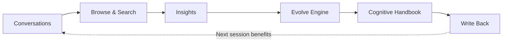
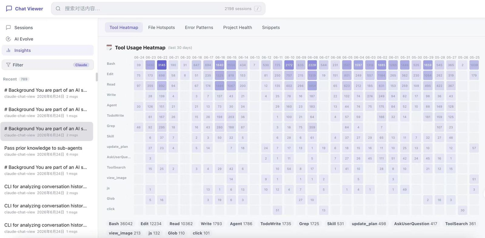
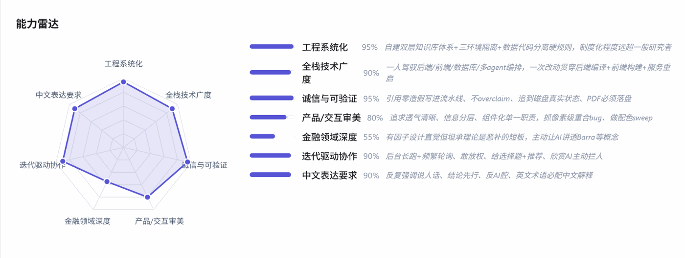

<div align="center">

  <h1 align="center">ConvoLab</h1>

  <p align="center"><strong>Stop Re-Teaching Your AI Coding Assistant</strong></p>

  <p align="center" style="font-size: 14px; color: #888; max-width: 700px; margin: 10px auto;">
    🧠 <em>Distill your forgotten judgments, decisions, and corrections into reusable AI collaboration assets — so Claude Code / Codex never starts from zero again.</em>
  </p>

  <p style="margin: 20px 0;">
    <a href="https://github.com/QuantaAlpha/Distill_Yourself"></a>
    <a href="LICENSE"></a>
    <a href="https://python.org"></a>
    <a href="."></a>
    <a href="."></a>
  </p>

  <p style="font-size: 16px; margin: 15px 0;">
    🌐 <a href="README.md">中文</a> | <a href="README_EN.md">English</a>
  </p>

</div>

<div align="center" style="margin: 20px 0;">
  <a href="#-quick-start">
    
  </a>
  <a href="docs/USER_GUIDE.md">
    
  </a>
  <a href="#-citation">
    
  </a>
</div>

---

<div align="center">
  
</div>

---

## 🎯 Why ConvoLab?

You've probably corrected Claude Code / Codex over and over:

* Don't touch unrelated files
* Read existing code before making changes
* Fix the bug — don't refactor the whole module while you're at it
* Too complex, just do the minimum viable fix
* Stop forgetting edge cases, tests, and project conventions

The problem: **these corrections only live in the current session.**

Close the terminal, and your judgments, decisions, and preferences sink into local JSONL logs. Next session, the AI starts fresh — like a new hire on day one.

ConvoLab does one thing:

> Turn Claude Code / Codex conversation history into searchable, analyzable, writable-back collaboration memory.

It's not another coding agent. It's long-term memory for the agents you already use.



---

## 🚀 Quick Start

Zero dependencies. Python 3.8+ is all you need.

```bash
git clone https://github.com/QuantaAlpha/ConvoLab.git
cd ConvoLab
python3 server.py        # → http://localhost:5757
```

Automatically scans local session directories:

```text
~/.claude/projects/          # Claude Code
~/.codex/sessions/           # Codex
~/.codex/archived_sessions/  # Codex (archived)
```

Browsing, search, and insights work out of the box. AI Chat, Evolve, and Cognitive Handbook require a local Claude Code or Codex CLI (calls it directly — no API key needed).

---

## ✨ Core Features

| Feature | What it solves |
|---|---|
| **Session Browser** | Aggregate scattered sessions with search, filtering, and structured replay |
| **Insights** | Tool heatmaps, file hotspots, recurring errors, project activity |
| **Evolve** | Distill repeated corrections into reusable preferences and behavior rules |
| **Cognitive Handbook** | Turn scattered corrections into structured Judgment Cards |
| **Preview & Sync** | Preview then write back to `CLAUDE.md` / `memory/` — effective next session |

---

## 🔄 From "Repeated Corrections" to "Reusable Memory"

Typical memory:

```text
User prefers concise code.
```

ConvoLab distills actionable collaboration judgments:

```text
When AI is fixing a local bug,
prefer the minimum necessary change — don't expand the diff for cleanliness;
unless adjacent code is itself the root cause.
```

These come from real corrections, rejections, follow-ups, and fixes in your sessions — not hand-written labels.

<div align="center">
  
</div>

---

## 🧠 Cognitive Handbook: Remember Not Just Rules, But Why You Judge That Way

ConvoLab's core isn't saving chat logs — it's distilling collaboration judgments.

Say you've repeatedly said:

* "Don't touch unrelated files"
* "Read existing code first"
* "Too complex, simplify"
* "Don't turn a local fix into a big refactor"

ConvoLab organizes these into a Judgment Card:

```text
Trigger:    AI is fixing a local bug but starts modifying adjacent modules.
Judgment:   User protects minimal blast radius — extra changes add review cost and regression risk.
Action:     Complete the minimum fix within requested scope first.
Exception:  If the adjacent module is genuinely the root cause, explain why, then ask to expand scope.
```

This is far more useful than "user likes small changes." Next time the AI faces a new task, it reuses your judgment logic — not keyword matching.

---

## 📝 Write Back: Actually Teach It Once

Confirmed memories can be written back to Claude Code's context:

```text
~/.claude/CLAUDE.md      ← Profile + Cognitive Runtime Pack
~/.claude/memory/        ← Memory Cards
```

Always previewed before writing. Never pollutes your global config automatically.

| Output | Destination | Automatic? |
|---|---|---|
| Profile | `CLAUDE.md` marked section | Requires confirmation |
| Memory Cards | `~/.claude/memory/` | Requires confirmation |
| Cognitive Runtime Pack | `CLAUDE.md` marked section | Requires confirmation |
| Rules / Signals / Patterns | Display only, never written | — |

---

## 📊 Screenshots

<div align="center">
  
  <p style="font-size: 12px; color: #666;">Session Browser: structured conversation replay with outline and AI Chat</p>
</div>

<div align="center">
  
  <p style="font-size: 12px; color: #666;">Tool Heatmap: daily tool usage intensity at a glance</p>
</div>

<div align="center">
  
  <p style="font-size: 12px; color: #666;">Profile Radar: multi-dimensional skill assessment with evidence chain</p>
</div>

---

<details>
<summary><b>⌨️ CLI Usage</b></summary>

```bash
# Basic queries
python3 analyze.py sessions --source claude --date 7d --limit 20
python3 analyze.py search "authentication bug" --project my-app
python3 analyze.py read abc123
python3 analyze.py corrections --date 30d
python3 analyze.py decisions --date 30d
python3 analyze.py files --date 30d
```

```bash
# Evolve
python3 analyze.py evolve-rules
python3 analyze.py evolve-signals
python3 analyze.py evolve-patterns
python3 analyze.py aggregates
python3 analyze.py profile-digest
```

```bash
# Cognitive Handbook
python3 analyze.py twin-stats
python3 analyze.py twin-events --signal correction --limit 50
python3 analyze.py twin-cards --status confirmed
python3 analyze.py twin-traits --category decision-style
python3 analyze.py twin-search "minimal fix" --limit 20
python3 analyze.py twin-compile --run-id latest
```

All commands support `--json`, `--source`, `--date`, `--project`, `--limit`.

</details>

<details>
<summary><b>⚙️ Configuration & Architecture</b></summary>

```bash
PORT=3000 python3 server.py   # default: 5757
```

```text
ConvoLab/
├── server.py          # HTTP server, REST API, JSONL parser, AI proxy, SSE
├── db.py              # SQLite, FTS5 search, cognitive model tables
├── analyze.py         # CLI analytics, Evolve, Twin operations
├── start.sh
├── docs/
│   └── USER_GUIDE.md
└── static/
    ├── index.html     # SPA shell
    ├── app.js         # Core logic
    ├── evolve.js      # Evolve visualizations
    ├── twin.js        # Cognitive Handbook UI
    └── style.css
```

| Source | Location | Format |
|---|---|---|
| Claude Code | `~/.claude/projects/` | JSONL |
| Codex | `~/.codex/sessions/` | JSONL |
| Codex (archived) | `~/.codex/archived_sessions/` | JSONL |

</details>

<details>
<summary><b>🏗️ Design Principles</b></summary>

| Principle | Implementation |
|---|---|
| **Local-first** | Only reads local sessions, never phones home |
| **Zero install** | Python stdlib + vanilla JS, no external deps |
| **Evidence-backed** | Every memory and card retains its evidence chain |
| **Preview-first** | Write-back always requires preview confirmation |
| **Model-agnostic** | Memory written as natural language context, not hidden model state |

</details>

---

## 🔒 Privacy

All indexing, search, analysis, and write-back happens locally. Session data is only read from your machine — never uploaded to any external service. The frontend loads D3.js from CDN for visualizations (no session content is transmitted). For fully offline operation, vendor D3 into `static/`.

---

## 📄 Citation

```
Distill Yourself: From AI Coding Sessions to Digital-Twin Memory for Self-Evolving Agents
```

Core idea: user corrections are implicit supervision; behind repeated corrections lie contextual judgments that AI can reuse.

---

## 🤝 Contributing

We welcome contributions!

<a href="https://github.com/QuantaAlpha/Distill_Yourself/graphs/contributors">
  
</a>

- **🐛 Bug Reports**: [Open an issue](https://github.com/QuantaAlpha/Distill_Yourself/issues)
- **💡 Feature Requests**: [Start a discussion](https://github.com/QuantaAlpha/Distill_Yourself/discussions)
- **🔧 Code Contributions**: Submit PRs for fixes, improvements, or new features

---

## License

This project is licensed under the [MIT License](LICENSE).
