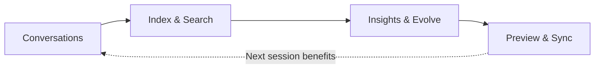

<div align="center">

[中文](README.md) | **English**

# Distill Yourself

**Search your Claude Code and Codex history. Distill durable lessons. Teach future sessions.**

Your Claude Code and Codex sessions contain decisions, debugging insights, and preferences you've repeated dozens of times — but they vanish when the terminal closes. Distill Yourself indexes that history locally, makes it searchable, and writes selected insights back into your Claude Code config so you never repeat yourself.

<a href="docs/video/full-demo.mp4">
  
</a>

[Click the preview to watch the full demo video (7:33)](docs/video/full-demo.mp4)

[Quick Start](#quick-start) · [Features](#features) · [User Guide](docs/USER_GUIDE.md) · [API Reference](#rest-api)

[](https://python.org)
[](.)
[](.)
[](https://sqlite.org)
[](LICENSE)

</div>

---

## Quick Start

**Option A — Install globally, run from anywhere:**

```bash
# Install with uv (recommended)
uv pip install git+https://github.com/QuantaAlpha/Distill_Yourself.git

# Or with pip
pip install git+https://github.com/QuantaAlpha/Distill_Yourself.git

# Launch from any directory
distill-yourself
# Open http://localhost:5757
```

**Option B — Clone and run directly (zero install):**

```bash
git clone https://github.com/QuantaAlpha/Distill_Yourself.git
cd Distill_Yourself

# No dependencies — pure Python stdlib
python3 server.py
# Open http://localhost:5757
```

Sessions from Claude Code and Codex are detected automatically — no import needed.

| Source | Location | Status |
|--------|----------|--------|
| Claude Code | `~/.claude/projects/` | Auto-detected |
| Codex | `~/.codex/sessions/` and `~/.codex/archived_sessions/` | Auto-detected |

> **Browsing, search, and analytics work immediately.** AI Chat and Evolve call your installed CLI — no app-level API keys needed, but at least one CLI tool must be installed and authenticated:
> `npm i -g @anthropic-ai/claude-code` or `npm i -g @openai/codex`

### What gets written back?

The Evolve engine can sync insights to your AI's config. **Nothing is written without preview and explicit confirmation.**

| What | Target | Action |
|------|--------|--------|
| Profile (developer persona) | `~/.claude/CLAUDE.md` | Append or replace section |
| Memory (preferences) | `~/.claude/memory/*.md` | Create / update individual memory files |
| Rules, Signals, Patterns | — | View only, never written |

> **Codex sessions are indexed and searchable, but write-back currently targets Claude Code config only.**

### Privacy & Data Flow

- **Indexing, search, and analytics are fully local** — your conversation data is read from local directories and stored in a local SQLite database (`.cache/sessions.db`)
- **AI Chat and Evolve** call your installed Claude Code or Codex CLI, which may send selected context to their respective cloud providers (Anthropic / OpenAI) — Distill Yourself does not make direct API calls
- **D3.js CDN** — the frontend loads D3.js from its official CDN for visualizations; no conversation data is transmitted. For fully offline use, vendor D3 into `static/`
- **Config write-back** — only after preview and explicit confirmation (see table above)

---

## Features

### Cognitive Model — Distill Yourself

The namesake feature. Analyzes your full conversation history across three layers of abstraction and constructs a cognitive model of how you work:

- **L1 — Evidence Events**: Raw behavioral signals extracted from conversations (corrections, preferences, recurring patterns)
- **L2 — Judgment Cards**: Distilled decision tendencies with confidence scores and supporting evidence
- **L3 — Cognitive Traits**: Generalized personality and work-style traits, each grounded in multiple judgment cards

The model includes a generated cognitive avatar and a one-line persona summary. Everything is traceable — click any trait to see the judgment cards and raw evidence behind it. Use it to understand what your future AI sessions should remember about how you think and decide.

The Runtime Pack compiles these traits into a concise, readable summary of who you are as a developer — ready to be synced into your AI's config.

<p align="center">
  
  
</p>

[▶ Watch the Cognitive Model demo clip (1:55)](docs/video/chapters/cognitive-model.mp4)

### Evolve Engine

Analyzes recurring preferences, corrections, and work patterns, then prepares config updates you can review before syncing.

| Dimension | What it answers |
|-----------|----------------|
| **Profile** | What kind of developer you are (persona card + radar chart) |
| **Memory** | What your AI should remember (preference graph + evidence cards) |
| **Rules** | What you've corrected repeatedly (P0/P1/P2 with original quotes) |
| **Signals** | Are corrections increasing or decreasing over time |
| **Patterns** | What problems keep recurring (bubble clusters + suggestions) |

<p align="center">
  
  
</p>

[▶ Watch the Evolve demo clip (1:55)](docs/video/chapters/evolve.mp4)

### Browse & Search

- **Dual-source aggregation** — Claude Code + Codex sessions in one place, tagged by source
- **Full-text search** — search across session titles and your messages, jump to the exact match
- **Multi-filter** — narrow by source, date range, or project
- **Structured reading** — expand messages, inspect tool calls, jump through session outline; sidebar shows AI summary and per-session chat


[▶ Watch the Browse & Search demo clip (0:55)](docs/video/chapters/browse-search.mp4)

### Insights

Five analytics views computed locally — no AI engine needed:

- **Tool Heatmap** — daily usage intensity of each tool type
- **File Hotspots** — most frequently read/written files across sessions
- **Error Patterns** — recurring errors clustered by type, with project context
- **Project Health** — session volume and activity trends per project
- **Code Snippets** — generated code fragments + whether they were committed


[▶ Watch the Insights demo clip (0:50)](docs/video/chapters/insights.mp4)

### AI Chat

Ask questions about your own history in natural language — per-session ("What caused this bug?") or cross-session ("Which project has the most errors this month?"). Built-in prompt presets for requirement extraction, decision review, rule generation, and efficiency analysis. Streaming responses powered by your local CLI.

### Closed Loop



---

## Architecture

```
Distill_Yourself/
├── server.py       # HTTP server, REST API, JSONL parser, AI proxy, SSE streaming
├── db.py           # SQLite storage, FTS5 search, pre-aggregated analytics
├── analyze.py      # Standalone CLI analytics & Evolve generators
├── static/         # Vanilla JS SPA + D3.js visualizations
└── docs/
    └── USER_GUIDE.md
```

| Principle | How |
|-----------|-----|
| No package install | Python stdlib server; D3.js loaded via CDN by the browser |
| Privacy first | Indexing/search read local `~/.claude/` and `~/.codex/`; AI features use your installed CLI |
| Incremental | Tracks file mtimes; only re-parses changed JSONL files |
| Fast search | SQLite FTS5 full-text index on `.cache/sessions.db` |
| Real-time | SSE streaming for AI Chat and Evolve progress |

---

## CLI

`analyze.py` works standalone — useful for scripts, pipelines, or agent workflows.

```bash
# List recent Claude sessions from the past 7 days
python3 analyze.py sessions --source claude --date 7d --limit 20

# Full-text search across all conversations
python3 analyze.py search "authentication bug" --project my-app

# Read a specific session's full message history
python3 analyze.py read <session-id>

# Extract architectural decisions from the past month
python3 analyze.py decisions --date 30d

# Find recurring errors in a project
python3 analyze.py errors --project my-app

# Generate Evolve outputs (rules / signals / patterns)
python3 analyze.py evolve-rules

# Export pre-computed analytics used by the Evolve AI engine
python3 analyze.py aggregates
```

Most commands support `--json`, `--source`, `--date`, `--project`, and `--limit`.

---

## REST API

<details>
<summary><b>Endpoints</b></summary>

| Method | Endpoint | Description |
|--------|----------|-------------|
| `GET` | `/api/sessions` | List sessions (filterable) |
| `GET` | `/api/session/:id` | Full message history |
| `GET` | `/api/session-summary` | Condensed summary |
| `GET` | `/api/projects` | Detected projects |
| `GET` | `/api/search?q=...` | Full-text search |
| `GET` | `/api/timeline` | Daily session counts |
| `GET` | `/api/analytics` | Tool usage & file hotspots |
| `GET` | `/api/project-health` | Per-project scores & trends |
| `GET` | `/api/snippets` | Extracted code snippets |
| `GET` | `/api/file-evolution` | Cross-session file edit timeline |
| `GET` | `/api/evolve/:tab` | Evolve data (profile/memory/rules/signals/patterns) |
| `GET` | `/api/stats` | Global statistics |
| `GET` | `/api/refresh` | Rebuild session index |
| `POST` | `/api/chat` | AI chat |
| `POST` | `/api/chat/stream` | Streaming AI chat (SSE) |
| `POST` | `/api/evolve/sync` | Sync Evolve results to AI config |

</details>

---

## Configuration

| Variable | Default | Description |
|----------|--------:|-------------|
| `PORT` | `5757` | Server port |

```bash
PORT=3000 python3 server.py
```

---

## Contributing

Contributions are welcome! Please open an issue first to discuss what you'd like to change.

```bash
git clone https://github.com/QuantaAlpha/Distill_Yourself.git
cd Distill_Yourself
python3 server.py          # start dev server
# open http://localhost:5757
```

---

## Community

Join the community to share tips, feedback, and ideas about Distill Yourself.

### WeChat


### Discord

[Join the Discord community](https://discord.gg/KDyuer49t)

---

## License

[MIT](LICENSE)
